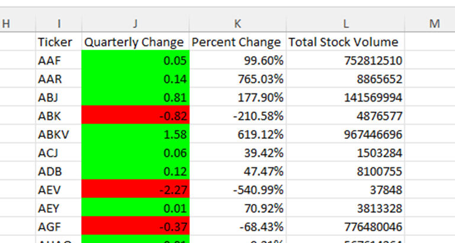
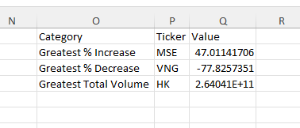
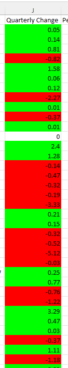
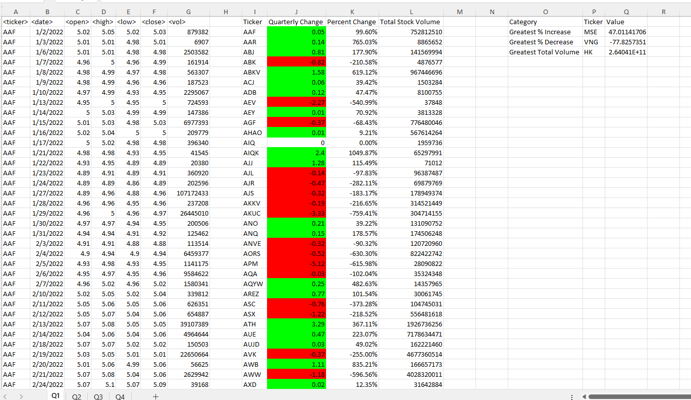
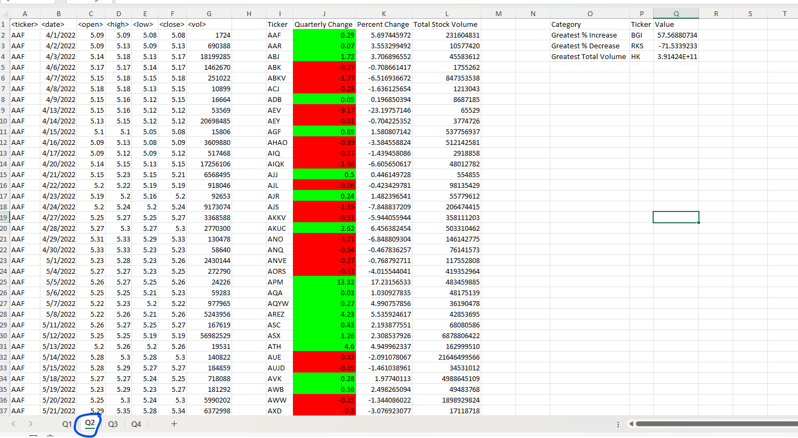
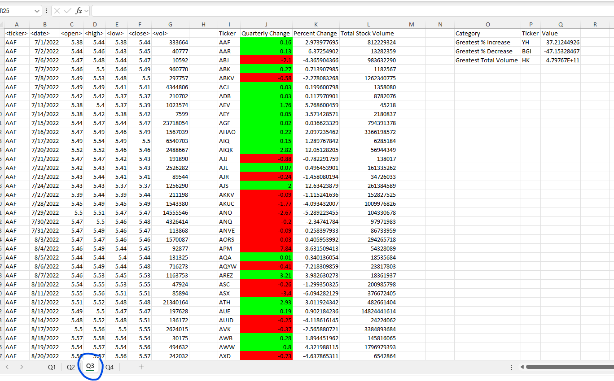
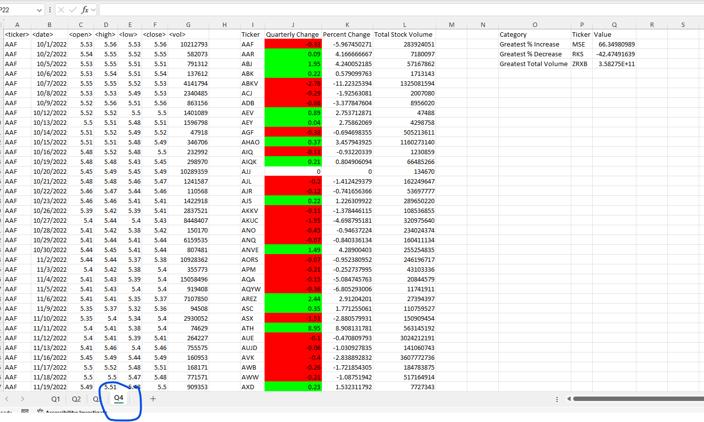

# VBA-Challenge

## Module 2 Challenge
### The assignment required writing a VBA script to analyze stock data across four worksheets (Q1, Q2, Q3, Q4). The goal was to calculate several key metrics for each stock ticker and summarize the results. The key metrics reviewed are as follows:
- Calculation of quarterly metrics for each ticker
- Identification of the greatest metrics (% increase, % decrease, total volume)
- Conditional formatting
- Automation across multiple worksheets

## How I completed the Assignment
### I wrote a VBA script that loops through each row of stock data in all four quarterly worksheets. The script checks for each ticker's data, calculates the required metrics, and populates the results in new columns (I, J, K, L). 

### While looping through the data, I tracked the greatest % increase, % decrease, and total volume; populating the worksheet with the calculated values. 

### After calculating the quarterly change for each stock, the script applied conditional formatting to highlight postiive changes in green and negative changes in red. 

### The script was designed to loop through all four worksheets (Q1, Q2, Q3, Q4) automatically. Each worksheet was processed in the same manner so as to produce consistent results across each worksheet. 

## Resources 
### I utilized the following resources to complete this assignment:
- TA assistance during office hours
- 1:1 Tutoring through online tutoring sessions
- Group discussions from class and via slack
- Chatgpt to assist with debugging 
- Youtube to research more information on github and read.me files
- Class examples that utilized different pieces of the script needed to complete this task
